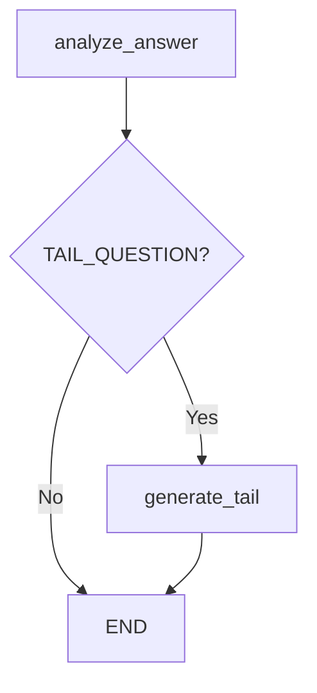

# Project Architecture

> PlayProbie AI Engine 아키텍처 (2025 Best Practices)

## Service Role

PlayProbie AI Engine은 **Stateless AI Worker**입니다.

```
┌─────────────────┐       REST API       ┌──────────────────┐
│  Spring Boot    │ ─────────────────▶   │   AI Engine      │
│  Main Server    │ ◀─────────────────   │   (FastAPI)      │
│                 │   JSON / SSE Stream  │                  │
└─────────────────┘                      └──────────────────┘
        │                                         │
        ▼                                         ▼
   Database (User Data)               AWS Bedrock (Claude)
```

## Key Characteristics

| 특성                | 설명                                           |
| ------------------- | ---------------------------------------------- |
| **Stateless**       | 세션/상태를 직접 관리하지 않음                 |
| **No DB Access**    | 사용자 데이터베이스 직접 접근 불가             |
| **Async-First**     | 모든 I/O 작업은 비동기로 처리                  |
| **Sidecar Pattern** | Main Server의 AI 추론 전담 Worker              |
| **Gateway Route**   | 모든 요청은 Spring Boot를 통해 들어옴          |

---

## FastAPI Lifespan Pattern (2025 Standard)

> ⚠️ `@app.on_event("startup")` / `@app.on_event("shutdown")` 는 **deprecated**

### Lifespan State 패턴 (권장)

`app.state`를 활용하여 lifespan에서 초기화한 리소스를 의존성으로 주입합니다.

```python
from contextlib import asynccontextmanager
from fastapi import FastAPI, Request

@asynccontextmanager
async def lifespan(app: FastAPI):
    # 🚀 Startup: 리소스 초기화 → app.state에 저장
    app.state.bedrock_service = BedrockService()
    logger.info("Starting up...")

    yield  # 서버 작동 중...

    # 🛑 Shutdown: 리소스 정리
    logger.info("Shutting down...")
    # 필요시 cleanup 로직

app = FastAPI(lifespan=lifespan)
```

### Lifespan State 접근 패턴

```python
from fastapi import Request, Depends
from typing import Annotated

# ✅ Request를 통해 app.state 접근 (권장)
async def get_bedrock_service(request: Request) -> BedrockService:
    return request.app.state.bedrock_service

# Type Alias 정의
BedrockServiceDep = Annotated[BedrockService, Depends(get_bedrock_service)]
```

---

## Dependency Injection (2025 Standard)

### 1. Annotated + Depends 패턴 (권장)

```python
from typing import Annotated
from fastapi import Depends, Request

# Lifespan State 기반 DI
async def get_bedrock_service(request: Request) -> BedrockService:
    return request.app.state.bedrock_service

BedrockServiceDep = Annotated[BedrockService, Depends(get_bedrock_service)]

@router.post("/draft")
async def generate_draft(
    request: FixedQuestionDraftCreate,
    service: BedrockServiceDep,  # ✅ 깔끔한 타입 힌트
):
    return await service.generate_fixed_questions(request)
```

### 2. Class-based Dependency + Depends() Shortcut

클래스 기반 의존성에서 `Depends()` 빈 괄호를 사용하면 타입에서 자동 추론합니다.

```python
class CommonQueryParams:
    def __init__(self, q: str | None = None, skip: int = 0, limit: int = 100):
        self.q = q
        self.skip = skip
        self.limit = limit

@router.get("/items")
async def get_items(
    commons: Annotated[CommonQueryParams, Depends()],  # ✅ 빈 Depends()
):
    return {"q": commons.q, "skip": commons.skip}
```

### 3. Sub-dependencies 패턴

의존성이 다른 의존성에 의존하는 체인 구조를 지원합니다.

```python
# 1단계: 기본 의존성
async def get_bedrock_service(request: Request) -> BedrockService:
    return request.app.state.bedrock_service

# 2단계: 상위 의존성 (BedrockService를 주입받음)
async def get_interaction_service(
    bedrock_service: BedrockServiceDep,
) -> InteractionService:
    return InteractionService(bedrock_service)

InteractionServiceDep = Annotated[InteractionService, Depends(get_interaction_service)]
```

### 4. Generator 패턴 (with cleanup)

리소스 정리가 필요한 경우 `yield`를 사용합니다.

```python
async def get_db_session() -> AsyncIterator[AsyncSession]:
    async with async_session_maker() as session:
        try:
            yield session
        except Exception:
            await session.rollback()
            raise
        finally:
            await session.close()

DBSessionDep = Annotated[AsyncSession, Depends(get_db_session)]
```

---

## Communication Patterns

### 1. Synchronous (REST API)

- `POST /fixed-questions/draft` - 고정 질문 생성
- `POST /fixed-questions/feedback` - 질문 피드백 반영

### 2. Streaming (SSE)

- `POST /surveys/interaction` - 실시간 설문 상호작용

```python
from fastapi.responses import StreamingResponse

@router.post("/interaction")
async def process_interaction(
    request: SurveyInteractionRequest,
    service: InteractionServiceDep,
):
    return StreamingResponse(
        service.stream_interaction(request),
        media_type="text/event-stream",
        headers={
            "Cache-Control": "no-cache",
            "Connection": "keep-alive",
            "X-Accel-Buffering": "no",  # Nginx 버퍼링 비활성화
        },
    )
```

---

## LangGraph Workflow Pattern



### Async Node 패턴 (권장)

```python
async def analyze_answer_node(state: AgentState) -> dict:
    """비동기 노드 - await 사용"""
    result = await bedrock_service.analyze_answer_async(...)
    return {"action": result["action"], "analysis": result["analysis"]}
```

---

## Environment Variables

| 환경 변수           | 필수 | 설명                  | 예시                                     |
| ------------------- | ---- | --------------------- | ---------------------------------------- |
| AWS_ACCESS_KEY_ID   | ⚠️   | AWS Access Key ID (Optional for IAM Role) | `AKIA...`                                |
| AWS_SECRET_ACCESS_KEY| ⚠️   | AWS Secret Key (Optional for IAM Role)    | `wJalr...`                               |
| AWS_REGION          | ✅   | AWS 리전              | `ap-northeast-2`                         |
| BEDROCK_MODEL_ID    | ✅   | Claude 모델 ID        | `anthropic.claude-3-5-sonnet-...`        |
| TEMPERATURE         | ✅   | 생성 온도 (0.0~1.0)   | `0.7`                                    |
| MAX_TOKENS          | ✅   | 최대 출력 토큰 수     | `4096`                                   |
| TOP_P               | ✅   | Top-P 샘플링 값       | `0.9`                                    |
