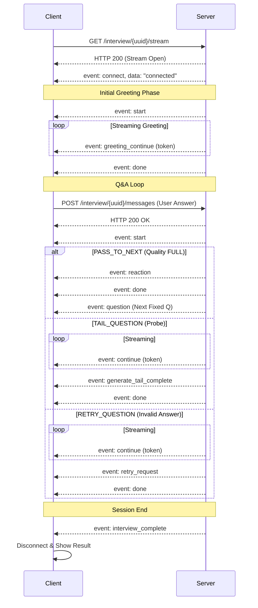

# Spring Server SSE Implementation Documentation

This document describes the internal implementation of SSE (Server-Sent Events) within the Spring Boot server, detailing how it mediates interactions between the Client and the FastAPI AI server.

## Overview

The Spring Server acts as a **stateful mediator** and **proxy**. It maintains the source of truth for the interview session (DB) while efficiently streaming real-time responses from the AI server to the Client.

### Key Components

| Component | Responsibility |
|-----------|----------------|
| `InterviewController` | **Entry Point**. Handles `GET /stream` requests and `POST /messages` from the Client. |
| `SseEmitterService` | **Connection Manager**. Manages `SseEmitter` instances and handles the actual pushing of events to clients. |
| `InterviewService` | **State Authority**. Manages `SurveySession` state, validates answers, and persists logs (Questions/Answers) to the H2 Database. |
| `FastApiClient` | **AI Proxy**. Connects to the FastAPI server, subscribes to its SSE stream, parses events, triggers business logic (DB saves), and re-emits events to the Client. |

---

## Data Flow & Architecture

### 1. Connection & Session Initialization (Opening Phase)

When a client connects to the SSE endpoint, the server immediately triggers the AI Opening sequence.

**Endpoint**: `GET /interview/{sessionUuid}/stream`

1.  **Client Connection**:
    -   `InterviewController` calls `SseEmitterService.connect(uuid)`.
    -   Spring sends an initial `connect` event to the Client.
2.  **AI Opening Trigger**:
    -   Controller asynchronously calls `FastApiClient.streamOpening()`.
    -   Spring `POST`s to FastAPI `/surveys/start-session`.
3.  **Streaming & Relay**:
    -   FastAPI streams `greeting_continue` → Spring `FastApiClient`.
    -   Spring proxies these tokens to the Client immediately.
4.  **Completion**:
    -   On `greeting_done`, Spring automatically fetches the **First Fixed Question** from the DB (`InterviewService.getFirstQuestion`).
    -   Spring sends the `question` event to the Client to start the actual interview.

### 2. Interaction Loop (Q&A Phase)

The core loop involves the user sending an answer and the system generating reaction, analysis, and subsequent questions.

**Endpoint**: `POST /interview/{sessionUuid}/messages`

1.  **User Answer Receipt**:
    -   Client sends `UserAnswerRequest`.
    -   `InterviewService.saveInterviewLog` validates the turn number and saves the answer to the DB.
    -   **Correction Policy**: If Client state (`fixedQId`, `turnNum`) mismatches Server state, Server values take precedence.
2.  **AI Request**:
    -   Spring `FastApiClient.streamNextQuestion` prepares context (history, current tail count, limit checks).
    -   If `TailCount >= Max`: Spring **skips AI call**, immediately fetches Next Fixed Question, and sends `done` (tail limit exceeded).
    -   Otherwise: Spring `POST`s to FastAPI `/surveys/interaction` (SSE stream).
3.  **Event Processing (FastApiClient)**:
    -   **`reaction`**: Proxied to Client (Toast message).
    -   **`continue`**: Proxied to Client (Streaming tokens).
    -   **`generate_tail_complete`**:
        -   **Action**: `InterviewService.saveTailQuestionLog` saves the generated question to DB.
        -   **Event**: Forwarded to Client to finalize the message.
    -   **`retry_request`**:
        -   **Action**: Increments retry count in DB.
        -   **Event**: Forwarded to Client (UI shows retry prompt).
    -   **`done`**:
        -   Parses `action` (TAIL vs PASS_TO_NEXT).
        -   If `PASS_TO_NEXT`: Spring fetches the next fixed question from DB and sends it.
        -   If `should_end`: Triggers Closing Phase.

### 3. Closing Phase

When the interview ends (due to `should_end` flag or running out of questions).

1.  **Trigger**:
    -   Logic in `FastApiClient` detects completion condition.
    -   Calls `streamClosing()`.
2.  **Process**:
    -   Spring `POST`s to FastAPI `/surveys/end-session`.
    -   Streams closing remarks (`continue` events) to Client.
    -   On completion, calls `InterviewService.completeSession()` to mark DB status as `FINISHED`.
    -   Triggers asynchronous **Session Embedding** (`triggerSessionEmbedding`).
    -   Sends `interview_complete` event to Client.

---

## Event Mapping Table

How internal FastAPI events are mapped/handled before reaching the Client.

| FastAPI Event (Source) | Handling Logic in Spring | Client SSE Event (Dest) |
|------------------------|--------------------------|-------------------------|
| `start` | Proxied | `start` |
| `greeting_continue` | Proxied | `greeting_continue` |
| `greeting_done` | **Triggers Logic**: Fetch First Question from DB | `question` (Generated by Spring) |
| `continue` | Proxied | `continue` |
| `generate_tail_complete`| **DB Write**: `saveTailQuestionLog` | `generate_tail_complete` |
| `reaction` | Proxied | `reaction` |
| `retry_request` | **DB Write**: `saveRetryQuestionLog` | `retry_request` |
| `analyze_answer` | **Internal**: Stores `nextAction` state | *(Not sent to client)* |
| `done` (with action) | **Logic**: Decides next step (Next Q or Wait) | `done` (or `question` if Next Q) |
| `interview_complete` | **DB Write**: `completeSession` | `interview_complete` |

---

## State Management & Consistency

-   **Turn Numbers**: Spring calculates `nextTurnNum` derived from DB state, not relying solely on AI's response.
-   **Tails Counting**: Spring tracks tail question counts (`UserAnswerRequest.turnNum - 1`) and enforces the limit (`maxTailQuestions`) **before** calling the AI.
-   **Legacy Support**: Handles cases where `turnNum` might be missing by inferring from context.

---
---

# client-server SSE flow

# Server-Sent Events (SSE) Documentation

This document describes the SSE (Server-Sent Events) implementation for the Survey Session feature (Interview Chat).

## Endpoint Information

- **URL**: `/interview/{sessionUuid}/stream`
- **Method**: `GET`
- **Content-Type**: `text/event-stream`

## Connection Flow

1.  **Client Request**: The client requests a connection to the SSE endpoint using the survey session UUID.
2.  **Server Response**: The server accepts the connection and keeps it open for streaming.
3.  **Initial Event**: The server immediately sends a `connect` event to confirm the connection is active.
4.  **Keep-Alive**: The server may send optional periodic comments or heartbeat events to keep the connection alive (though `EventSource` handles reconnection automatically).

## Event Types

### `connect`

Sent immediately upon successful connection.

*   **Data**: String literal `"connected"`

### `start`

Sent when the AI begins processing a task (e.g., generating a response to a user answer or starting a new question).

*   **Data Schema**: `ApiSSEStartEventData`
    ```json
    {
      "status": "processing"
    }
    ```

### `question`

Sent when a complete question is ready. This is used when streaming is not active or for the final finalized question text.

*   **Data Schema**: `ApiSSEQuestionEventData`
    ```json
    {
      "fixed_q_id": number | null, // ID of the fixed question (if applicable)
      "q_type": "FIXED" | "TAIL" | "OPENING" | "CLOSING" | "GREETING",
      "question_text": "string",   // The full text of the question
      "turn_num": number           // Current turn number
    }
    ```

### `continue`

Used for streaming the AI's question generation token by token.

*   **Data Schema**: `ApiSSEContinueEventData`
    ```json
    {
      "content": "string"   // Single character/token
    }
    ```

### `greeting_continue`

Used specifically for streaming the initial greeting message token by token.

*   **Data Schema**: `ApiSSEContinueEventData`
    ```json
    {
      "content": "string"   // Single character/token
    }
    ```

### `reaction`

Sent when the AI generates a reaction or feedback to the user's previous answer. This is a ephemeral message shown as a toast or side-note, not persisted as a formal Q&A turn.

*   **Data Schema**: `ApiSSEReactionEventData`
    ```json
    {
      "reaction_text": "string", // The reaction message
      "turn_num": number
    }
    ```

### `generate_tail_complete`

Sent when a tail (probe) question has been fully generated. This signals the client to finalize the streamed message.

*   **Data Schema**: `ApiSSEGenerateTailCompleteEventData`
    ```json
    {
      "message": "string",           // Full question text
      "tail_question_count": number, // Current tail question count
      "probe_type": "string"         // DESCRIPTIVE, EXPLANATORY, etc.
    }
    ```

### `retry_request`

Sent when the AI requests the user to retry their answer (e.g., due to off-topic, ambiguous, or unintelligible responses).

*   **Data Schema**: `ApiSSERetryRequestEventData`
    ```json
    {
      "message": "string",       // Retry prompt text
      "followup_type": "string" // rephrase, redirect, clarify, refusal_nudge
    }
    ```

### `done`

Sent when the AI has finished generating content for the current turn.

*   **Data Schema**: `ApiSSEDoneEventData`
    ```json
    {
      "turn_num": number
    }
    ```

### `interview_complete`

Sent when the entire survey session is finished. The client should close the connection and show the completion screen.

*   **Data Schema**: `ApiSSEInterviewCompleteEventData`
    ```json
    {
      "status": "completed"
    }
    ```

### `error`

Sent when a server-side error occurs during processing.

*   **Data Schema**: `ApiSSEErrorEventData`
    ```json
    {
      "code": "string",    // Error code
      "message": "string"  // Error message
    }
    ```

## Interaction Sequence Diagram



---
---

# SSE Flow Documentation (FastAPI)

This document describes the **current implementation** of the Server-Sent Events (SSE) flow in the FastAPI server (`InteractionService`).
It reflects the logic where the AI workflow is executed in full (`ainvoke`) before streaming the results.

## Overview

- **Endpoint**: `POST /surveys/interaction` (Relayed by Spring to Client)
- **Method**: SSE Streaming
- **Strategy**:
  1.  Execute full LangGraph workflow (`ainvoke`).
  2.  Collect final state (`final_state`).
  3.  Emit SSE events sequentially based on the final state.

---

## Event Sequence

The events are emitted in the following strict order:

### 1. Start
Indicates looking for a response.
```json
{
  "event": "start",
  "data": {
    "status": "processing",
    "phase": "main"
  }
}
```

### 2. Validity Result
Emitted if validity check was performed.
```json
{
  "event": "validity_result",
  "data": {
    "validity": "VALID",        // VALID, OFF_TOPIC, AMBIGUOUS, etc.
    "confidence": 0.95,
    "reason": "...",
    "source": "rule"
  }
}
```

### 3. Quality Result
Emitted if quality check was performed (only for `VALID` answers).
```json
{
  "event": "quality_result",
  "data": {
    "quality": "GROUNDED",      // EMPTY, GROUNDED, FLOATING, FULL
    "thickness": "HIGH",
    "richness": "LOW",
    "thickness_evidence": [...],
    "richness_evidence": [...]
  }
}
```

### 4. Analyze Answer
Emitted for all interactions to indicate the decision (Action).
```json
{
  "event": "analyze_answer",
  "data": {
    "action": "TAIL_QUESTION",  // TAIL_QUESTION, PASS_TO_NEXT, RETRY_QUESTION
    "analysis": "...",
    "should_end": false,
    "end_reason": null,
    "probe_type": "DESCRIPTIVE" // Optional (if TAIL)
  }
}
```

### 5. Reaction (Conditional)
Emitted **ONLY** if `action` is `PASS_TO_NEXT`.
```json
{
  "event": "reaction",
  "data": {
    "reaction_text": "좋은 의견 감사합니다!"
  }
}
```

### 6. Message Streaming (Conditional)
Emitted **ONLY** if `action` is `TAIL_QUESTION` or `RETRY_QUESTION`.
The message is streamed character by character.

**Event**: `continue`
```json
{
  "event": "continue",
  "data": {
    "content": "구"  // Single character/token
  }
}
```

### 7. Message Completion (Conditional)
Emitted immediately after streaming finishes.

**If `TAIL_QUESTION`**:
```json
{
  "event": "generate_tail_complete",
  "data": {
    "message": "구체적으로 어떤 점이 좋았나요?",
    "tail_question_count": 1,
    "probe_type": "DESCRIPTIVE"
  }
}
```

**If `RETRY_QUESTION`**:
```json
{
  "event": "retry_request",
  "data": {
    "message": "다시 한 번 말씀해 주시겠어요?",
    "followup_type": "rephrase"
  }
}
```

### 8. Done
Emitted at the very end of the stream.
```json
{
  "event": "done",
  "data": {
    "status": "completed",
    "action": "TAIL_QUESTION",
    "phase": "main",
    "question_text": "구체적으로 어떤 점이 좋았나요?", # (Or null if PASS)
    "should_end": false,
    "end_reason": null,
    "validity": "VALID",
    "quality": "GROUNDED"
  }
}
```

---

## Scenario Examples

### Scenario A: Tail Question (Probe)
1.  `start`
2.  `validity_result` (VALID)
3.  `quality_result` (GROUNDED)
4.  `analyze_answer` (TAIL_QUESTION)
5.  `continue` ("구")... `continue` ("?")
6.  `generate_tail_complete`
7.  `done`

### Scenario B: Pass to Next
1.  `start`
2.  `validity_result` (VALID)
3.  `quality_result` (FULL)
4.  `analyze_answer` (PASS_TO_NEXT)
5.  `reaction` ("완벽하네요!")
6.  `done`

### Scenario C: Refusal / Retry
1.  `start`
2.  `validity_result` (REFUSAL)
3.  `analyze_answer` (RETRY_QUESTION)
4.  `continue` ("짧")... `continue` ("?")
5.  `retry_request`
6.  `done`


---
---
